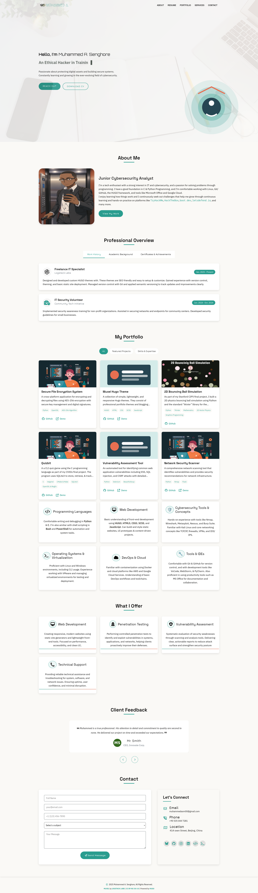

<h1>Muxel Theme <span style="font-size: small">v1.0.0</span></h1>

### A **_"tech-themed"_** Hugo Portfolio Theme

**Muxel** is a modern, clean & responsive tech-themed Hugo portfolio theme designed for developers, and professionals who want to showcase their work with style and clarity.
It's built for performance and simplicity, and it offers a light-first design (with dark mode support coming soon), and responsive layouts.

     


## 🚀 Features

- Developer-focused portfolio layout
- Light mode (dark mode coming soon)
- Clean, minimalist, and responsive.
- Easy setup & configuration.
- SEO and accessibility friendly

## 📸 Screenshots & Demo
- [msio.me](https://msio.me)



## 🔧 Quick Start

> **Prerequisites**: Git, dart-sass, Hugo

1. This theme is available as a template.
    - Click on the <kbd>Use this template</kbd> button and then select <kbd>Create a new repository</kbd>.
    - Name the new repository with a name of your choice.
    - Clone the repository then modify to your satisfaction.

2. If you don't want to use the template you can follow the steps below:
    - In your site's root directory run the following commands below
      ```bash
      git init
      ```
      ```bash
      git submodule add https://github.com/logstacklabs/muxel.git themes/muxel
      
      // OR

      git clone https://github.com/logstacklabs/muxel.git themes/muxel
      ```
      ```bash
      echo 'muxel' >> hugo.toml
      ```
      ```bash
      cd themes/muxel && npm install
      ```
      ```bash
      hugo server
      ```

Then Preview your site at [localhost:1313](http://localhost:1313).

## 🍰 Contributing
[](CODE_OF_CONDUCT.md)
- Check out this guide [link](https://daily.dev/blog/how-to-contribute-to-open-source-github-repositories)
- Also makesure to record your changes in the [changelog](CHANGELOG.md) file.


## 🛡️ License

This project is licensed under the Creative Commons Attribution-NonCommercial-ShareAlike 4.0 International License (CC BY-NC-SA 4.0).

[](https://creativecommons.org/licenses/by-nc-sa/4.0/)

## 🙏 Acknowledgements
- **[HUGO](https://gohugo.io)**
- **[Canva](https://canva.com)**
- **[Coolors](https://coolors.co/)**
- **[Web3Forms](https://web3forms.com)**
- **[Font Awesome](https://fontawesome.com/)**
- **[Google Fonts](https://fonts.google.com)**
- **[EON Color Palette](https://logstacklabs.github.io/eon-swatches/)**
- **[Ikatyang's Emoji-cheat-sheet](https://github.com/ikatyang/emoji-cheat-sheet/blob/master/README.md#place-map)**

### 💝 Support

For any issues or questions, please [open an issue](https://github.com/logstacklabs/muxel/issues) on GitHub.

---

<!--h4>🧐**Designed with ❤️ by [LSL](https://logstack.dev)**</h4-->
